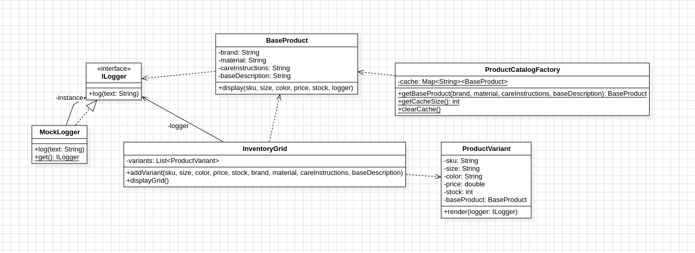

# LP5_Flyweight

O projeto exibe milhares de variações de produtos de um e-commerce economizando muita memória RAM através do padrão **Flyweight**. Ele faz isso ao compartilhar dados pesados e repetitivos (como marca e material) num cache único, instanciando individualmente apenas as informações únicas de cada item (como tamanho e preço).

## Diagrama de Classe

